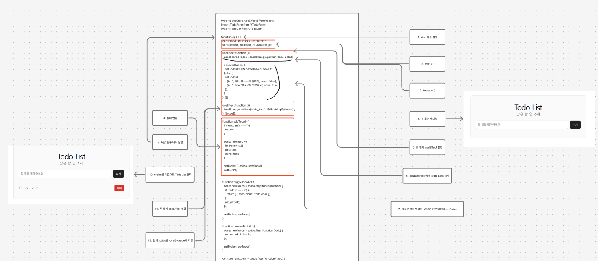

# 프로젝트 제목
## 1. 개요
### 이 프로젝트는 props, state, hook, useEffect 를 이용한 Todo List 만드는 프로젝트입니다.

## 2. 주요 기능 설명
이 프로젝트의 주요 기능은 다음과 같습니다.
- 할 일 입력
- 할 일 추가
- 할 일 완료/미완료 전환
- 할 일 삭제
- 남은 할 일 개수 표시
- localStorage 저장
- localStorage 복원

## 3. API 구조
## API
| Method | URL | 설명 |
|--------|-----|------|
| POST | /api/login | 로그인 |
| GET | /api/data | 조회 |


## 3. 기술 스택
### 프론트엔드
- react
- CSS
- javascript

## 4. 시스템 구조설명


## 5. 클라이언트 실행 흐름

1. App 함수 실행
2. text = ''
3. todos = []
4. 첫 화면 렌더링
5. 첫 번째 useEffect 실행
6. localStorage에서 todo_data 읽기
7. 저장값 있으면 복원, 없으면 기본 데이터 setTodos
8. 상태 변경
9. App 함수 다시 실행
10. todos를 기준으로 TodoList 출력
11. 두 번째 useEffect 실행
12. 현재 todos를 localStorage에 저장

사용자가 입력하고 버튼을 누르면 흐름은 다음과 같다.

1. 입력창에 글자 입력
2. setText 실행
3. 상태 변경
4. 화면 갱신
5. 추가 버튼 클릭
6. addTodo 실행
7. 새 객체 생성
8. setTodos 실행
9. 목록 갱신
10. 두 번째 useEffect 실행
11. localStorage 저장

## 6. 디렉토리 구조
```
src/
├── App.jsx
├── TodoForm.jsx
└── TodoList.jsx
```
## 7. 실행 방법
```
vite 서버를 실행 -> cloudflard와 연결 -> App.jsx overwriting -> TodoForm과 Todolist src폴더에 writing -> cloudflared 주소 접속
```

## 8. 회고
이 프로젝트를 진행하면서 상태 변수와, 상태 변수 제어함수의 관계에 대해서 알게 되었다.
또한 useEffect의 실행 순서가 화면이 렌더링 된 후에 실행되어 화면에 반영된다는 것,
상태 변화가 일어날 때 마다, App 함수가 재시작되는 시스템에 대해서도 알게 되었다.

props라는 개념을 react에서 처음 접하게 되었는데, props가 읽기 전용이고 바꾸려면 부모 컴포넌트에 요청을 해야하는 이유에 대해서 정리해보게 됐었다. 왜냐하면 에러가 났을 경우 부모와 자식의 선후 관계를 파악할 수 없으면 어디서 에러가 나고 다시 디버깅하기 쉽지 않기 때문이다.

여러가지 개념들을 실습을 하면서 한 만큼 다시 구조파악을 하며 정리하는 시간이 필요하다.
